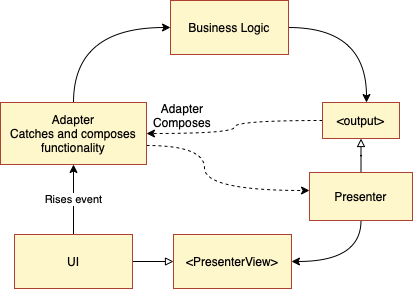
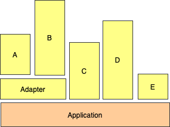
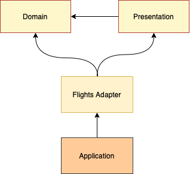
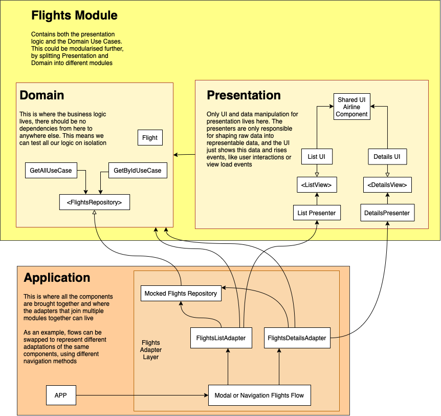

# Modular Architecture
The goal is to separate the code into different components that are loosely coupled and are isolated from other components as much as possible.

# Goals

## Achieve Teams Independence
This makes the teams work more freely, not being blocked by other teams

## Improve Testability
As components are small and have very limited responsabilities, they can be easiliy tested.

### Tests are easy to write
Since there's no complex mocking stages, where you have to stub complex dependencies that may not be owned by the module, creating a test is a simple task. Just creating an instance with a stub dependency, call a method and assert output.

### Tests run fast
Compilation should be rather quick, since you should not have dependencies (at the very least on your Domain module) and, as you don't need to mock complex and unknown behaviour from external sources, the tests should run without any timers or background threads.

## Improve Scalability
Adding new features translates to just creating a new class or struct and compose it with the existing functionality on the adapter layer.

## Accelerate Feature Development
This is key to achieve business goals. Getting Quality and rich experiences with a short Time-To-Market should be the goal of every architectural decision ever made.

### Quality
Super High test coverage is achievable.
### Speed
Each component is super simple, so creating new ones or editing existing ones is just a matter of creating or editing a short list of files. No need to spend lots of time to figure out how a Flag that's defined outside your module can randomly affect you.

# Unidirectional Data Flow
Code should follow SOLID principles, and the first one to keep in mind, is the S (Single Responsability).
Just get an input, and produce an output.
This can vary from component to component. For example, views are raising events as the output, but other classes may just return a value.

Here's a visual representation of what this translates to in code

# Dependencies Graph
The benefit of a modular architecture, is that it enables modules to grow independently, so you can have farily big modules that contain a lot of features, along side another small module that just contains a simple feature, like an About screen.

## Flights Dependencies Graph Example
We have a few different components on this example
## Simplified graph

## Domain
This is where the business logic lives, there should be no dependencies from here to anywhere else. This means we can test all our logic on isolation, aka, no `imports` here!
## Presentation
Only UI and data manipulation for presentation lives here. The presenters are only responsible for shaping raw data into representable data, and the UI just shows this data and rises events, like user interactions or view load events
Only imports from the Domain module should be found here. as this is where the domain modules are translated and send over to the UI
### Presenter
This just gets a domain, or Use Case result and transforms it into a UI representable model, flattening the domain into a single, simple new model that's just a set of strings, numbers or booleans
### UI
Just receives data to display, no decisions should be made here whenever possible.
Just update state and draw.
## Flights Module
Contains both the presentation logic and the Domain Use Cases.
This could be modularised further, by splitting Presentation and Domain into different modules.
In this particular case, the separation between Domain and Prosentation is Logical, so they live in the same Module, but are separated into folders.
## Flights Adapter Layer (DI Management)
Here's where all the components are brought together. It's important to understand that this layer lives as close to the Application as possible, since it's specific for that particular app.
For example, we may compose the app in a specific way for our Test Example Project, in another for the Alpha Builds and in another for the production builds.
Here we can split functionality based on feature flags, composing our feature with a different screen if flag X is equal to Y or another value
Also, since the app will know and depend on all the modules that will be inside it, we can access other modules from here and create adapters of them to be used from our module.
## Application
This is where all the components are brought together and where the adapters that join multiple modules together can live
As an example, flows can be swapped to represent different adaptations of the same components, using different navigation methods
## Detailed Flights Feature Dependency Graph

